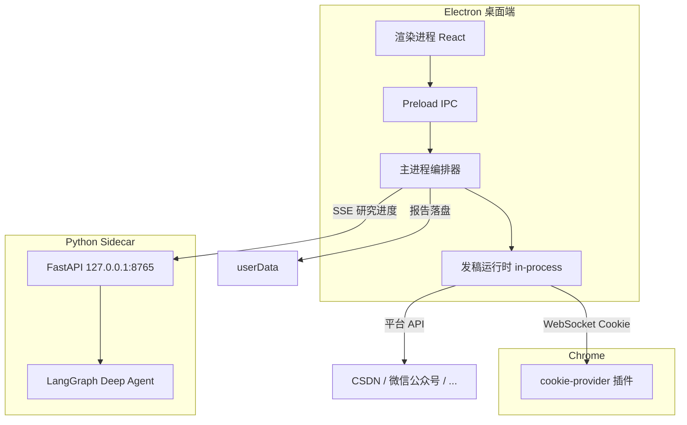

# Deep Research Agent

**深度搜索 + 多平台发布桌面端** — 用 AI 做深度研究，审阅后一键同步草稿到 CSDN、微信公众号等平台。

> 研究（Python / LangGraph）与发稿（Node / 浏览器 Cookie）分离编排，桌面端统一调度。Cookie 不出本机，报告必须人工审阅后才可发布。

---

## 它能做什么

- **深度研究**：输入主题，Agent 自动规划、搜索、撰写，实时 SSE 推送进度，输出 Markdown 报告
- **人工审阅**：研究完成后进入编辑页，可修改标题与正文，**不会自动发稿**
- **多平台草稿**：勾选已登录平台，一键同步为草稿（默认 `draftOnly: true`）
- **本地 Cookie 桥接**：Chrome 插件提供登录态，经本地 WebSocket 传给发稿服务，Cookie 不离开本机

典型工作流：

```
输入主题 → AI 深度研究 → 审阅编辑 → 选平台发草稿
```

---

## 功能特性

| 特性 | 说明 |
|------|------|
| 流式研究进度 | SSE 推送 `planning → searching → writing → done`，可随时取消 |
| 报告持久化 | 研究报告落盘到本地，sidecar 重启不丢数据 |
| 内嵌发稿运行时 | Electron 主进程直接启动发稿服务，无需额外 Node 进程 |
| 安全隔离 | 渲染进程通过 IPC 通信，`contextIsolation` 开启，不直连 Python |
| 平台适配器 | 继承 [Wechatsync](https://github.com/wechatsync/Wechatsync) 核心，支持 18+ 平台 |
| 热点预留 | `TrendProvider` 接口已定义，后续可接入 CSDN / 公众号热榜选题 |

---

## 架构



| 模块 | 路径 | 技术 | 端口 |
|------|------|------|------|
| 桌面端 | `packages/desktop` | Electron + React | — |
| 研究服务 | `packages/research-agent` | Python FastAPI + LangGraph + SSE | `8765` |
| 发稿服务 | `packages/local-server` | Node（主进程内嵌或独立 CLI） | HTTP `8787` / WS `9527` |
| 平台适配 | `packages/core` | TypeScript 适配器 | — |
| Cookie 插件 | `packages/cookie-provider` | Chrome Extension | 连 `9527` |

所有服务仅绑定 `127.0.0.1`，详见 [`docs/contracts.md`](docs/contracts.md)。

---

## 快速开始

### 环境要求

- **Node.js** 20+
- **pnpm** 9+
- **Python** 3.11+，并安装 [uv](https://docs.astral.sh/uv/)
- **Chrome** 浏览器（加载 cookie-provider 插件）

### 安装

```bash
git clone <your-repo-url>
cd deep-research-agemt

pnpm install
pnpm build

cd packages/research-agent && uv sync && cd ../..
```

### 配置

```bash
cp .env.example .env
```

编辑 `.env`，填写 API Key：

```env
OPENAI_API_KEY=sk-xxx          # LLM 密钥（默认对接 DeepSeek）
TAVILY_API_KEY=tvly-xxx        # 网络搜索密钥
```

默认模型为 DeepSeek（`OPENAI_BASE_URL=https://api.deepseek.com/v1`），可改为任意 OpenAI 兼容接口。

### 加载 Chrome 插件

```bash
pnpm build:provider
```

1. 打开 `chrome://extensions`，开启**开发者模式**
2. 点击**加载已解压的扩展程序**，选择 `packages/cookie-provider/dist`
3. 在插件弹窗填写 Token：`wechatsync-local`（与 `.env` 中 `WECHATSYNC_TOKEN` 一致）
4. 在 Chrome 中登录目标平台（如 CSDN、微信公众号）

### 启动

```bash
pnpm desktop:dev
```

一条命令同时拉起 Electron 桌面端、发稿服务与研究 sidecar。顶部状态栏会显示 Cookie 插件与研究服务的连接状态。

---

## 使用说明

应用分为三个步骤，**审阅不可跳过**：

### 1. 研究

在「研究」页输入主题，点击开始。界面实时显示 SSE 进度，完成后自动进入审阅页。

### 2. 审阅

编辑 AI 生成的标题与 Markdown 正文，确认无误后进入发布页。

### 3. 发布

勾选目标平台（需已在 Chrome 登录），点击发布。默认以**草稿**形式同步到各平台后台。

也可以跳过研究，直接在发布页粘贴 Markdown 手动发稿。

---

## 开发命令

```bash
pnpm desktop:dev     # 启动桌面端（推荐）
pnpm server          # 仅发稿服务
pnpm research:dev    # 仅研究服务
pnpm test:sync       # 命令行 E2E 测试（CSDN + 公众号草稿）
pnpm build           # 构建所有包
pnpm typecheck       # TypeScript 类型检查
```

---

## 支持的平台

发稿适配器继承自 Wechatsync，core 中包含以下平台实现：

CSDN · 微信公众号 · 知乎 · 掘金 · 简书 · 博客园 · 开源中国 · SegmentFault · 51CTO · 慕课网 · 百家号 · 豆瓣 · 雪球 · 东方财富 · 搜狐 · 微博 · B 站 · 语雀

> v1 已在 **CSDN** 和 **微信公众号** 上完成端到端验证，其他平台理论上可用，欢迎反馈。

---

## 项目结构

```
deep-research-agemt/
├── packages/
│   ├── desktop/           # Electron 桌面端 + React UI
│   ├── research-agent/    # Python 研究 Agent + FastAPI
│   ├── local-server/      # 发稿运行时（库 + CLI）
│   ├── core/              # 多平台适配器
│   └── cookie-provider/   # Chrome Cookie 桥接插件
├── docs/
│   ├── contracts.md       # API 契约（Research / Publish / Trends）
│   └── migration-notes.md # 上游迁移记录
├── scripts/
│   └── test-sync.mjs      # 发稿 E2E 测试脚本
├── .env.example
└── pnpm-workspace.yaml
```

---

## 配置参考

| 变量 | 默认值 | 说明 |
|------|--------|------|
| `WECHATSYNC_TOKEN` | `wechatsync-local` | 发稿服务鉴权 Token，插件需填相同值 |
| `WECHATSYNC_HTTP_PORT` | `8787` | 发稿 HTTP 端口 |
| `WECHATSYNC_WS_PORT` | `9527` | Cookie WebSocket 端口 |
| `RESEARCH_HTTP_PORT` | `8765` | 研究服务端口 |
| `RESEARCH_TOKEN` | `research-local` | 研究服务鉴权 Token |
| `OPENAI_API_KEY` | — | LLM API Key |
| `OPENAI_BASE_URL` | `https://api.deepseek.com/v1` | LLM 接口地址 |
| `OPENAI_MODEL` | `deepseek-chat` | 模型名称 |
| `TAVILY_API_KEY` | — | Tavily 搜索 API Key |

---

## 安全与隐私

- **Cookie**：仅经 cookie-provider → 本地 WebSocket（`127.0.0.1:9527`）传输，**不会出本机**
- **研究内容**：会发送给配置的 LLM 和 Tavily 搜索 API，使用前请知悉
- **发稿默认草稿**：`draftOnly: true`，不会直接公开发布
- **Agent 无发布权限**：研究 Agent 不包含发布工具，避免模型自作主张发稿

---

## 路线图

- [x] 深度研究 + SSE 进度 + 报告落盘
- [x] Electron 桌面端 + 内嵌发稿运行时
- [x] CSDN / 微信公众号草稿同步
- [x] 首次使用向导 + 单命令开发启动
- [ ] 平台热点采集（`TrendProvider` → 选题灌入研究主题）
- [ ] 研究历史列表 UI
- [ ] PyInstaller 内嵌 Python（当前需本机安装）
- [ ] electron-builder 打包分发

---

## 致谢

本项目基于以下开源项目迁移与整合：

- [Wechatsync](https://github.com/wechatsync/Wechatsync) — 多平台同步核心与平台适配器
- [deepagents](https://github.com/langchain-ai/deepagents) — LangGraph 深度研究 Agent 示例

上游迁移记录见 [`docs/migration-notes.md`](docs/migration-notes.md)。

---

## License

待定。上游 Wechatsync 组件请遵循其原有许可证。
